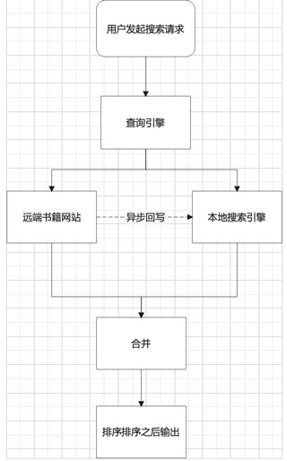

# 时宜搜书
由于国内去年严打书籍版权，再加上服务器费用着实也昂贵，所以在去年1月份选择了关闭站点，现在将时宜搜书的源代码进行开源。

巅峰时期，网站一天大概有1w左右的pv，部署在2C4G的机器上勉强可以工作。

时宜搜书的工作原理如下图:

    1. 在用户发起搜索请求的时候，向对应的书籍网站地址发送请求，以获取书籍的相关信息。
    2. 查询到书籍信息之后，存入es中进行缓存。
    3. 下次查询，将会合并es中的书籍信息和远端的书籍网站的书籍信息进行一个展示。

其本身并不存储任何数据，只是书籍网站进行一个解析操作。